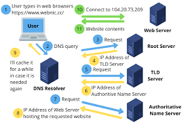

> records mapping of domain name to ip address. 

> User browser (domain) -> ISP (domain) -> DNS Infra (domain)  
  User browser (ip address) <-ISP (ip address) <- DNS Infra (ip address)  
  User browser (ip address request) -> ISP (ip address request) -> servers...

### Resource records
    Domain name to ip address mapping is in the form of resource records.
    smallest unit of information requested from name servers.

    > Common Types

    1. A (domain name:ip address)
        educative.io. 299 IN A 104.20.7.183 (299-time to live)
    2. CNAME (alias: actual domain)
        bar.example.com. CNAME foo.example.com.
    2. MX mail server for domain
        educative.io IN MX 10 aspmx2.googlemail.com

### Types of Servers in DNS Hierarchy
    Resolver Server
        premise of user's network. uses caching. called local or default servers.
    Root level 
        maintain server on top level domain name's. (.com, .edu, .io), will return list of top level domain ip address.
    Top level
        hold ip address of authoritative name servers. 
    
> Hierarchy from right to left (root server-> top level (.com, .edu) -> authoritative (google.com))

> DNS as a distributed system 
    avoid being a spof. 
    Caching - recently requested resource records.
    High replication
    udp protocol.