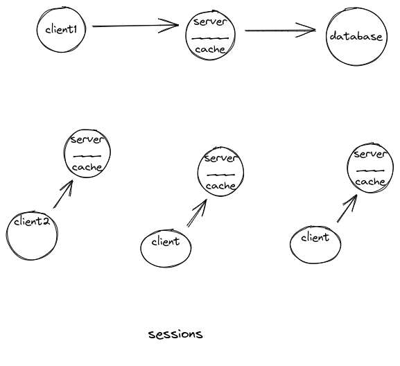

> reducing of network calls. 
> reducing load on db. 

> If there are multiple nodes serving requests, it's possible to have separate caches for each of the machines. if the load balancer randomly distributes requests across the nodes, thus increasing the cache miss. two choices for overcoming this are global cache & distributed caches.

### CDN briefly.

CDN's are kind of cache that come into picture while serving large amount's of static data. 
if the system isn't large to serve large amount of data, a separate server can be used for the same. 
it can be rerouted from dns to this server. 

### Cache  invalidation. 
    
    if data being modified is present as a cache, techniques to keep the data consistent in the cache and the db. 
    1. Write-through cache:
        modified in both places while write time. 
        pros: guarantees consistency, durability if power failure or crash.
        cons: latency

    2. Write-around cache:
        updated only in the backend, create a cache miss & read from slower main server and experience a higher latency.

    3. Write-back cache:
        updated only in the cache and confirmed with the client. 
        writing to a permanent storage is done after a while/under some conditions.

        pros: fast, good for write intensive.
        cons: may cause data loss - crash.  

### Popular Caching policy: 
    least recently used. (LRU)
    least frquently used (no of hits).

problems:

a scenario can happen that the cache being read by client2 is STALE, and just has been updated by client1.

the solution could be the cache can be moved out of each the servers and be a separate entity altogether.

problems:
    each time the user doesn't find the data in the cache, it is an extra call to the cache. 
    Thrashing - the caching policy does not work well as the data is hardly found in the cache. 

So where to place the cache ?

    - on the server side itself, in memory to each server. 
        - PROS: fast, good for a small amount of data.
        - CONS: 
        -   this can be dangerous if the server fails, it can take the cache down as well and as 
            a result, the data in both the servers might not be in sync. 
        -   this can be a problem in many cases as some financial records or so. 

    - can have some as a global cache, where each server queries the global cache. (REDIS)

Resources:
    
    https://lethain.com/introduction-to-architecting-systems-for-scale/
