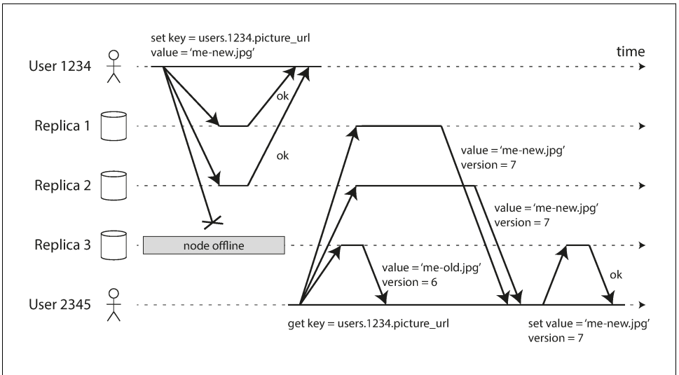
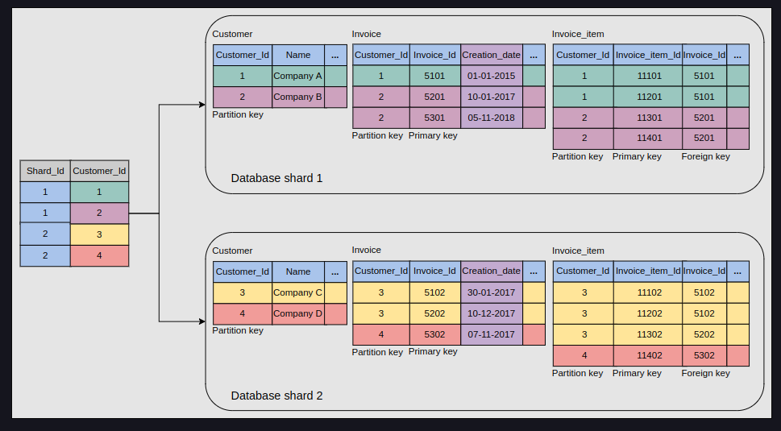

## Types

### Relational 
    - prior structure.
    
    Pros:
    - simplicity, robustness, scalability.
    - flexibility 
        DDL (data definition language allows us to modify schema while other queries are happening & db server is running.)
    - redundancy
        eliminates redundancy by normalisation.
    - provide ACID properties (refer 2.Basic/definitions.md)

    Cons:

    Impedence mismatch - the db structure vs the in-memory data structures can differ.
    
    For example there exists a user object, which has orders (needs fetching from orders tables) credit cards(needs fetching from cards tables) etc. Hence user being a single object has to fetch it's contents from a variety of different tables requiring join operations. 
    If it was a nosql db, it would have been in a single document. 

### Non-relational  

    - unstructured/semi-structured.
    
    Pros: 
    Simple Design:
        - (no impedence mismatch) - refer cons of sql db's.
    Horizontal Scaling:
        - can scale easily. stores information in one document vs multiple tables.
        - data is spread over multiple nodes and data is balanced(sharded) automatically.
        - also nodes are replaced easily. 
    Availability
        - node replacement can be performed without application downtime. 
    Cost
        - free/open source.

    Examples:

### Key-Value database
    values could be anything. 
    easy partitioning, horizontal scaling. 
    
    Use case:
    session oriented applications, where the metadata about the logged in user is stored as a key value pair
    
    Examples:
    dynamo db, redis, memcached.

### Document
    store and retrieve documents like json, bson. varying structures and data structures.
    
    Use case
    unstructure data like the e-commerce applications, where there are thousands of attriubte, also good for content management systems as every entity is stored as a single document. 

    Example:
    mongodb, google cloud firestore.
    
### Graph
    nodes entities, edges relations. 

    Use case:
    social media, relations. 

    Examples:
    neo4j, orientdb. 
    
### Column
    columns instead of rows. 

    Use case:
    large number of aggregation and data analytics queries.

    examples:
    cassandra, hbase, amazon simpledb.
    
    Cons:
        - No standardization:
            porting from one no sql to other is a challenge.
        - Tradeoff between consistency and availability in case of failures.

 
### Data Replication.

    keep multiple copies of data most likely geographically distributed.

    # Types of replication
    synchronous replication - primary waits for the secondary nodes. 
    asynchronousr replication - primary doesn't wait for secondary nodes. 

    # Data replication models
    
    1. Primary secondary replication - 
        
        data in secondary nodes kept in sync by the primary nodes. 
        
        Use Case:
        read-heavy applications. 
        read-resilient, applications can handle read even if the primary node fails.
        Bottleneck could be when there are too many secondary nodes to update.

        *
        Asynchronous type of replication fails here or isn't as effective. takes away the whole point of being read resilient.

        ## Methods to emulate primary seconday model of replication. 

            Statement based replication
                the primary node saves all the statement that it executes. passes to secondary nodes to execute.
                faces problem in functions such as NOW(), can cause issues in the order of execution. 
                was used in mysql until version 5.1
            
            Write-ahead log 
                stores the query in the log file before executing it in a log-file known as write ahead log. 
                the problem is that it defines the data in a low-level form. it is tightly coupled with the inner structure of the database engine.
            

            Logical-row based replication
                actually replicates the data from the primary node. binary logs generated by the primary node at the record level. 
                doesn;t have the difficulties of write-ahead log at doesn't require the information about the data layout inside.

    2. Multi-leader replication:
        
        asynchronous replication fails in the case of primary secondary, but it gives better performance and scalability in this. 
        the additional complexity here is to resolve conflicts. 

        Way to resolve conflicts:
            - conflict avoidance - for a certain record go via the same primary node.
            - custom logic
            - last write - problematic as a global clock. 

        ## Method to emulate multi-leader replication:
            star topology, circular topology, all-to-all topology.
            single point of failure in star and circular so not preferred.

    3. Peer to peer

        primary secondary replication, primary node is the bottleneck, achieves read scalability not write one. 
        here it's all-read all write. hence better for write too. 
        problem being multiple nodes can write the same data, results in concurrent write problem. 

        Way to solve concurrent write problem is the **quorums**. 

        (Designing data intensive applications - pg 177.)

Picture taken from Martin Kleppmann-Designing Data-Intensive Applications_ The Big Ideas Behind Reliable, Scalable, and Maintainable Systems-O’Reilly Media

## Partitioning

Defn: each piece of data, record or document belongs to exactly one partition.
also known as **Sharding**.

relational database after a point of time are difficult to fit in one node, split into multiple. 
but it has proven challenging to provide single node like properties over a distributed database.

moving to nosql can be tried but it is really expensive given the historical codebase and close cohesion.

Hence database paritioning helps us to use multiple nodes, where each node manages some part of the whole data. 

### Types of sharding

1. Vertical 
Break tables into multiple tables, if joins are to be perform on tables they should be kept in one shard. 
often the column with large text or blob is split into a different table.
done manually after stakeholders decision.

2. Horizontal

data just becomes too big and affects read-write latency. 
splitting the data row-wise.

a. Key based sharding
sometimes there exists foreign-key bound relationships. here the partitioning is performed along with the same partition key. 

b. Hash-based sharding
different values based on hash function. 
difficult if a new node is introduced. 

Consistent hashing
every node given a place on the circle, easy to scale horizontally. 
increases throughput and improves latency, also easy to add remove nodes.

Zookeeper
a partitioning management system takes care of mappings in network, each node connects to zookeper. whenever there is a change in partitioning the zookeeper is updated, notifies routing tier about the change. hbase, kafka, solrcloud use this.

## Tradeoff

Centralised

Adv:
easier to maintain, update, take backups. 
stronger consistency, ACID. 
Disadv:
slow down queries, high latency.
single point of failure.

Decentralised:
Adv:
faster, easy access to data from the nearest shard. 
parallel processing. 

Disadv:
could require data from multiple tables, takes time.
joins from multiple tables could take time. measures to keep data consistent. 